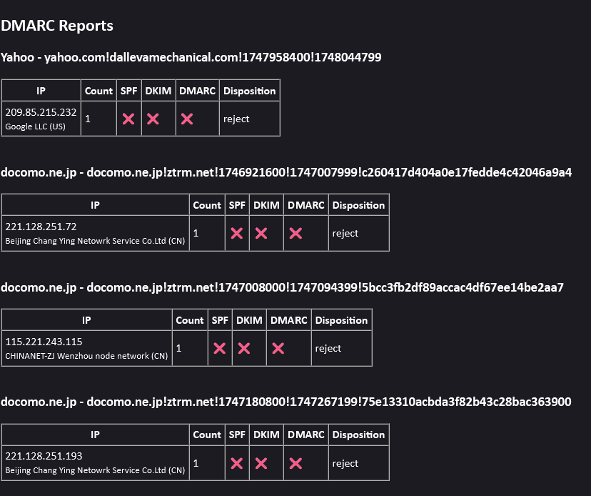
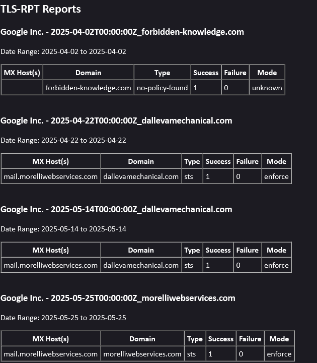

# DMARC & TLS-RPT Report Parser

This is a simple tool meant to help **.NET-inclined system administrators** who run and maintain email servers.

Manually downloading and unzipping every DMARC and TLS-RPT report you recieve from ISPs and email providers can get tedious.
But it is important to monitor these reports as part of proper email server administration.

This .NET console application parses through any **unread DMARC and TLS-RPT emails** from ISPs and email providers, then generates and sends a **user-friendly HTML summary report** by email.

Designed to run daily as a cron job or scheduled task, this tool supports:

- IMAP retrieval of DMARC and TLS-RPT ZIP reports
- Extraction and classification of report types
- Parsing into custom summary formats
- WHOIS lookups for DMARC source IPs, so you can see who and where someone is trying to spoof your domains
- Clean and readable email reports

## Example Summary Output

Here's what a typical email summary looks like:

DMARC Summary


TLS-RPT Summary


## Requirements

- .NET 8 Runtime (Framework-dependent deployment)
- IMAP access to one or more mailboxes (for monitoring DMARC and TLS-RPT reports)
- SMTP credentials for sending the summary email (can be the same as one of the mailboxes being monitored)

## Installation

1. Install the .NET 8 runtime:
   ```bash
   sudo apt install -y dotnet-runtime-8.0
2. Place the published application in a directory such as: 
    ```bash
    /opt/dmarc_tls_rpt_report_parser/
3. Set up the config.json file with:
  -Full Email server domain name 
  -IMAP account info
  -Paths for ZIP saving, extraction, and parsed output
  -SMTP credentials
  -Sending email account

4. Set up a cron job to run it daily:
   ```bash
   crontab -e
   15 7 * * * dotnet /opt/dmarc_tls_rpt_report_parser/DmarcTlsRptReportParser.dll >> /opt/dmarc_tls_rpt_report_parser/log.txt 2>&1
## Summary
This tool was built for operators who want visibility into email transport security without relying on vendor dashboards or proprietary platforms. Stay informed on DMARC alignment and TLS delivery posture—automatically, every morning.